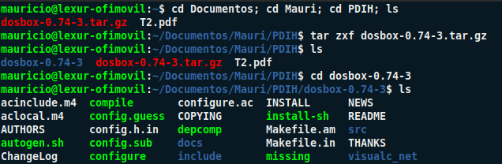
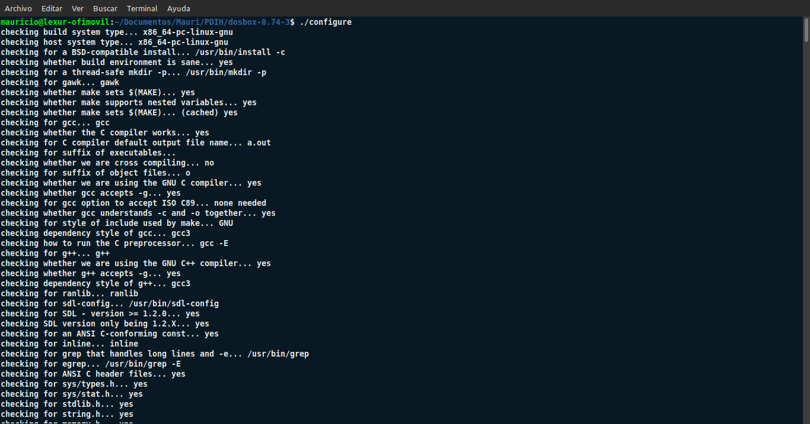
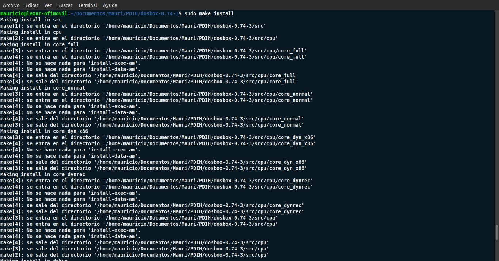
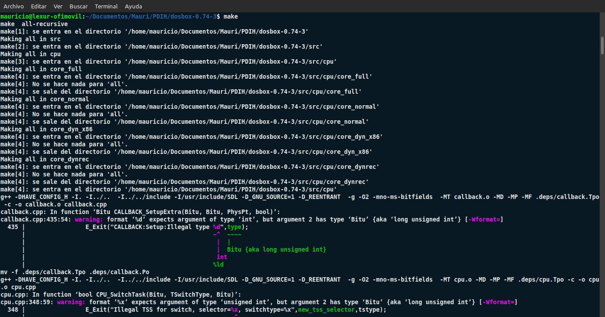
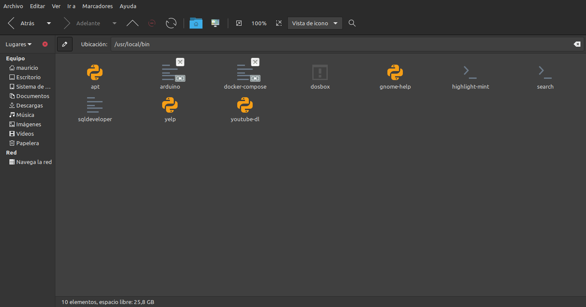

#   Seminario 1

##  Programación de dispositivos a bajo nivel

###  Mauricio Luque Jiménez

####  Índice

- [Instalación de DOSBOX](#instalacion)
- [Configuración inicial ](#configuracion)
- [Primer programa de ejemplo](#helloworld)

En este seminario se va a proceder a instalar el software DOSBOX, así como hacer una configuración inicial y unas primeras pruebas para comprobar su funcionamiento de cara a posteriores prácticas.

###  Instalación de DOSBOX

    El primer paso a realizar es instalar el software en nuestro equipo. Como se puede ver en la primera captura, ya tenemos el comprimido dentro del directorio personal PDIH. Si vemos su contenido, se encuentra todo lo necesario para su instalación y configuración.

    

    Vemos remarcado en verde el fichero _configure_, que es lo primero que vamos a ejecutar. En este caso, se nos pide la versión 1.2.0 de SDL, la librería que vamos a utilizar para la programación a bajo nivel y a nivel gráfico.

    

    El siguiente paso es instalar por consola el paquete _make_ para la compilación del código que vamos a programar en este seminario y en posteriores prácticas.

    
    

    Una vez que hemos completado todos estos pasos, ya tenemos disponible el ejecutable de DOSBOX en el directorio /usr/local/bin.

    

    El resto de pasos se van a realizar dentro del emulador DOSBOX, que ya está disponible para su utilización.

###  Configuración inicial

    Una vez hemos instalado el emulador, el siguiente paso es configurar opciones de inicio y las unidades que queremos montar en DOSBOX, para lo cual editaremos el fichero .conf